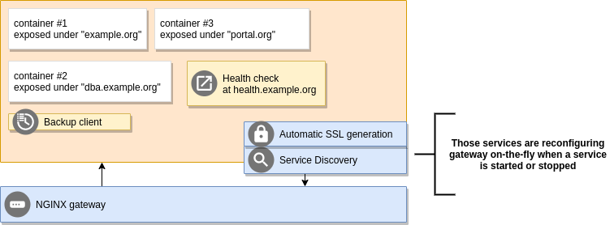

Understanding architecture
==========================

Harbor imposes the architecture of a centralized gateway for web services. It is just like in a cloud, or in Kubernetes -
the centralized Ingress/Webserver takes the traffic and routes it to other services.

**Advantages:**

- Easy to manage, and to maintain, one router to reload
- Integration with services such as LetsEncrypt without additional work to be done
- Most popular architecture for hosting multiple services
- SSL termination at the router edge makes SSL support almost transparent to applications
