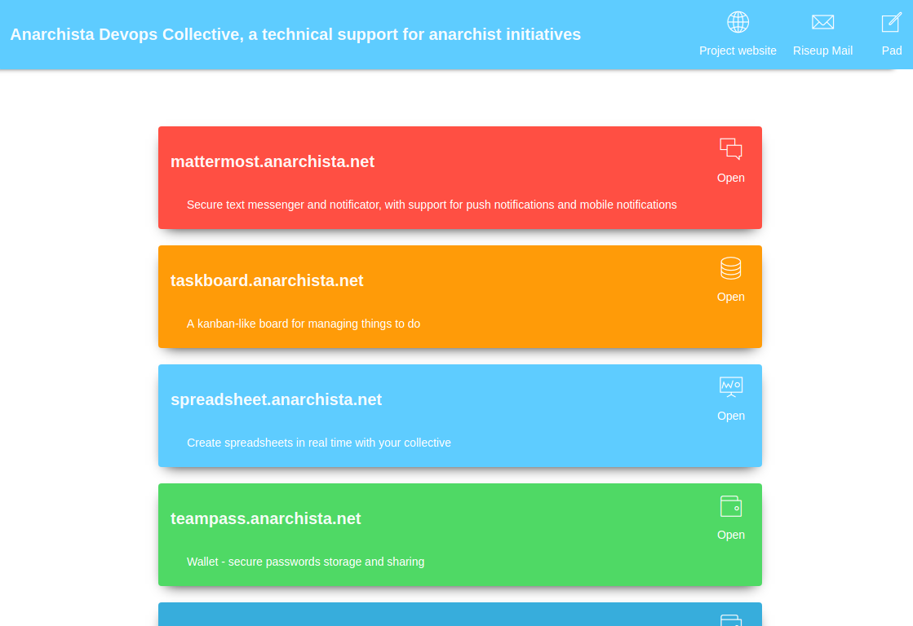
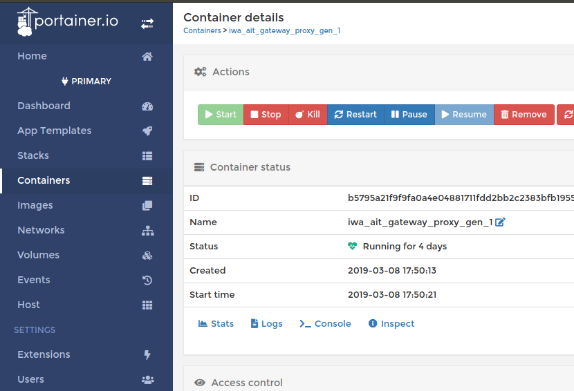
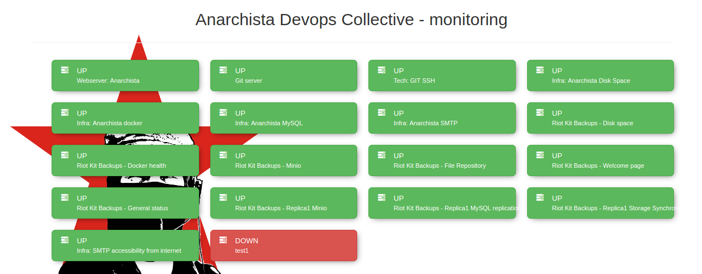

.. _features:

Features
========

Service discovery with SSL
--------------------------

Whenever you run a new application, even without restarting the whole environment, the **gateway_proxy_gen** container
is being notified about it and creates an nginx cnofiguration to expose your application. **gateway_letsencrypt** is also
notified and generates a SSL configuration, right after nginx is ready.

Step-by-step schema:

1. **gateway_proxy_gen** listens to docker events
2. **gateway_proxy_gen** generates nginx.conf for each TAGGED service in docker network (VIRTUAL_HOST, VIRTUAL_PORT, LETSENCRYPT_HOST and LETSENCRYPT_EMAIL must be present)
3. **gateway_letsencrypt** generates SSL certificates for recently added domains
4. **gateway** is being reloaded and uses new nginx.conf with SSL certificates

FAQ:

1. Multiple domains: Separate them by comma
2. For advanced usages see: docker-gen_ documentation
3. I need to modify nginx.conf, how to? It's easy. There are two solutions:

   a) Create a file with domain name in the **./containers/nginx/vhost.d** directory

    Example "test.mydomain.org" file:

    .. code:: yaml

        ## Start of configuration add by letsencrypt container
        location ^~ /.well-known/acme-challenge/ {
            auth_basic off;
            allow all;
            root /usr/share/nginx/html;
            try_files $uri =404;
            break;
        }
        ## End of configuration add by letsencrypt container

        proxy_read_timeout 120s;

    b) Modify directly the template from which the nginx.conf is created

*NOTE: During the make start the docker-gen container is modifying files in vhost.d directory. On production a script reset-nginx-conf-permissions.sh in make stop will attempt to restore file contents to allow git pull execution later*

.. _docker-gen: https://github.com/jwilder/docker-gen

Services dashboard
------------------

Often non-technical people are not aware of what services are actually hosted. There we resolve this problem
with an automatically generated list of running web-apps.

Applications needs to be tagged with docker labels, example:

.. code:: yaml

    org.docker.services.dashboard.enabled: true
    org.docker.services.dashboard.description: 'Dashboard - a list of all hosted websites running on this network'
    org.docker.services.dashboard.icon: 'pe-7s-browser'
    org.docker.services.dashboard.only_for_admin: false

Sending e-mails
---------------

Send e-mails directly or through a middle server, just by sending them on "smtp_server:25" without any authorization.
You can use any external SMTP, your own, a gmail account, or other.

.. code:: yaml

    SMARTHOST_ADDRESS=your-server.org    # your SMTP relay server address
    SMARTHOST_PORT=587
    SMARTHOST_USER=login@your-server.org
    SMARTHOST_PASSWORD=
    SMARTHOST_ALIASES=*    # forward all e-mails, you can put here eg. allowed recipient domains

If you make values empty, then the service will send mails directly.

Docker administration panel
---------------------------

We suggest to optionally use *Portainer* in case a need for web access to the environment.
*Portainer* is very lightweight and has support for almost all important features.

Uptime Board
------------

Dashboard with health check status. The status is fetched from an external service provider.

**Configuration in .env file:**

.. code:: yaml

    MONITORING_PROVIDERS=UptimeRobot://some-token;UptimeRobot://some-other-token

Integration with Ansible
------------------------

See: :ref:`ansible`

Templating
----------

Imagine that everything is in environment variables in **.env**, but you need to eg. initialize the MySQL database by creating multiple users and databases.
To allow keeping passwords safe in the **.env-prod**, but still automating eg. the user and password creation in databases we can use a templating mechanism.

.. code:: yaml

   Templating is GENERATING configuration files from templates, while having access to .env variables.

Workflow:

1. Create a template that will be rendered on **make start**
2. Mount compiled template to a volume eg. to the entrypoint.d directory

*Example ./containers/templates/source/mysql/access.sql.j2*

.. code:: sql

    /* transprzyjazn.pl */
    CREATE DATABASE IF NOT EXISTS transprzyjazn;
    CREATE USER IF NOT EXISTS 'transprzyjazn'@'%' IDENTIFIED BY '{{ DB_PASSWD_TRANSPRZYJAZN }}';
    GRANT ALL ON `transprzyjazn`.* TO 'transprzyjazn'@'%' IDENTIFIED BY '{{ DB_PASSWD_TRANSPRZYJAZN }}';

    /* lokatorzy.info.pl */
    CREATE DATABASE IF NOT EXISTS lokatorzy;
    CREATE USER IF NOT EXISTS 'lokatorzy'@'%' IDENTIFIED BY '{{ DB_PASSWD_LOKATORZY_INFO_PL }}';
    GRANT ALL ON `lokatorzy`.* TO 'lokatorzy'@'%' IDENTIFIED BY '{{ DB_PASSWD_LOKATORZY_INFO_PL }}';

You need to define environment variables in the **.env** (on following example: DB_PASSWD_TRANSPRZYJAZN and DB_PASSWD_LOKATORZY_INFO_PL).
The file will be rendered into **./containers/templates/compiled/mysql/access.sql.j2**
So, now you can mount the compiled mysql files directory into the MySQL container for example.

.. literalinclude:: ../../apps/conf/templates/docker-compose.db.yml.example
   :language: yaml

Backups
-------

The environment template natively chooses RiotKit's File Repository as the backups automation.
Requirement: You need to have a server running File Repository, check file-repository_.

Example *docker-compose.backup.yaml*

.. literalinclude:: ../../apps/conf/templates/docker-compose.backup.yml.example
   :language: yaml

**Configuration**

1. In **./containers/backup/bahub.conf.yaml** define backup definitions, a recovery plan, passwords. Take a look at the File Repository's documentation there: file-repository.docs.riotkit.org_
2. All collection ids, passwords extract to **.env** file, example: **collection_id: "${BACKUPS_PORTAINER_COLLECTION_ID}"**
3. Schedule some backup jobs in **./containers/backup/cron** eg. **0 1 * * MON bahub backup db**

**Recovery from backup**

There are multiple cases when you need to recover multiple containers, or all containers from latest version from backup.

Example cases:

- Server failure, need to recreate the server
- Server was compromised "hacked", need to restore latest copy of data
- Migrating from development environment into production-ready, working live server
- Migrating from server to server

.. code:: bash

    # will restore all services defined in bahub.conf.yaml into latest copy from backup server
    make recover_from_backup

*Note: Ansible deployment will attempt to take latest versions from backup when doing a first deploy on a server*

.. _file-repository: https://github.com/riotkit-org/file-repository
.. _file-repository.docs.riotkit.org: https://file-repository.docs.riotkit.org/en/latest/client/configuration-reference.html
