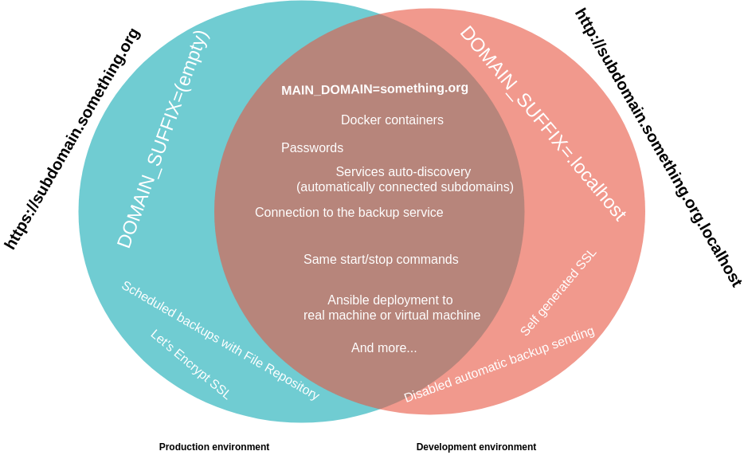

.. _general_concept:

General conception
==================

The idea of this environment template is to provide a base for small and medium projects, deployed on a single server.
With a high focus on ease of use. The environment should be also almost the same on development server as on production server.

There are a few **design patterns**, that are the basis of the environment conception.

Management from Makefile
------------------------

Everything important goes into the Makefile. There are no plain bash scripts outside of the Makefile.
The project is built in purely Makefile + YAML + docs + misc files.

.. code:: yaml

    make start
    make check_status
    make list_all_hosts
    make stop
    make build_docs
    make encrypt_env_prod

    # ...
    # and others

Multiple compose files can be toggled on/off
--------------------------------------------

Service definitions in Docker Compose format are kept in **./apps/conf** directory.
Services that are temporarily disabled are marked with ".disabled" at the end of filename.

.. code:: yaml

    ✗ make list_configs
    dashboard
    deployer
    health
    service-discovery
    smtp
    ssl
    technical
    uptimeboard

    ✗ make config_disable APP_NAME=ssl
     >> Use APP_NAME eg. make config_disable APP_NAME=iwa-ait
     OK, ssl was disabled.
    ✗ make config_enable APP_NAME=ssl
     >> Use APP_NAME eg. make config_disable APP_NAME=iwa-ait
     OK, ssl is now enabled.

Configuration in one file that could be encrypted
-------------------------------------------------

Good practice is to extract environment variables into .env files, instead of hard-coding values into services YAML definitions.
That makes a **.env** file from which we can use environment variables in YAML files with syntax eg. ${VAR_NAME}

As the **.env** cannot be pushed into the repository, there is a possibility to push **.env-prod** as a encrypted file with ansible-vault.

.. code:: yaml

    make encrypt_env_prod

Main domain and domain suffix concept
-------------------------------------

**MAIN_DOMAIN** can be defined in **.env** and reused in YAML files together with **DOMAIN_SUFFIX**.
It opens huge possibility of creating test environments, which have different DNS settings.
Sounds like a theory? Let's see a practical example!

| Domain     | MAIN_DOMAIN   | DOMAIN_SUFFIX  | Output domain              | Environment |
|------------|---------------|----------------|----------------------------|-------------|
| blog       | iwa-ait.org   | .localhost     | blog.iwa-ait.org.localhost | dev         |
| blog       | iwa-ait.org   |                | blog.iwa-ait.org           | production  |

It's so much flexible that you can host multiple subdomains on main domain, but you can also use totally different domains.
No /etc/hosts entries are required, it's a standard Linux DNS behavior.

**Example:**

.. code:: bash

    MAIN_DOMAIN=iwa-ait.org
    DOMAIN_SUFFIX=.localhost

.. code:: yaml

    first:
        environment:
            - VIRTUAL_HOST=some-service.${MAIN_DOMAIN}${DOMAIN_SUFFIX}

    second:
        environment:
            - VIRTUAL_HOST=other-service.example.org${DOMAIN_SUFFIX}

**In result of above example you will have services under domains in test environment:**

- some-service.iwa-ait.org.localhost
- other-service.example.org.localhost

**Complete example**

In `.env` file:

.. code:: bash

    MAIN_DOMAIN=iwa-ait.org
    DOMAIN_SUFFIX=.localhost

In `./apps/conf/docker-compose.phpmyadmin.yaml`:

.. code:: yaml

    db_mysql_admin:
        image: phpmyadmin/phpmyadmin
        environment:
            - PMA_HOST=db_mysql

            # gateway configuration
            - VIRTUAL_HOST=pma.${MAIN_DOMAIN}${DOMAIN_SUFFIX}
            - VIRTUAL_PORT=80
        labels:
            org.riotkit.dashboard.enabled: true
            org.riotkit.dashboard.description: 'MySQL database management'
            org.riotkit.dashboard.icon: 'pe-7s-server'
            org.riotkit.dashboard.only_for_admin: true

Now you can access http://pma.iwa-ait.org.localhost in your browser.
On production server just remove the DOMAIN_SUFFIX value to have http://pma.iwa-ait.org - simple enough, huh?

Automatic distinction between development and production server
---------------------------------------------------------------

There should be no need to have separated configuration files for local development environment, and for production environment.
Everything should be REALLY the same, except **DOMAIN_SUFFIX** variable, which should point to **.localhost** on development environment.

Whenever you will need to pass information to some docker container, that we are in **debug mode** you can use **${IS_DEBUG_ENVIRONMENT}** in YAML definition.
**IS_DEBUG_ENVIRONMENT** is a result of auto-detection if the environment is local or production, you may also set **ENFORCE_DEBUG_ENVIRONMENT=1** if you want to enforce debug environment.

*HINT: File Repository's Bahub integration configuration integrates with IS_DEBUG_ENVIRONMENT by stopping cronjobs, no backups are done from developer environment*
*HINT: Ansible deployment is able to modify .env variables when pushing changes to production.*

Applications pulled from git repositories
-----------------------------------------

Not always it's possible to package an application into container.
If we have a private application without public source code, and we do not have a private docker registry - then it's possible
to use a generic eg. PHP + NGINX container and **mount the application files as a volume**.

